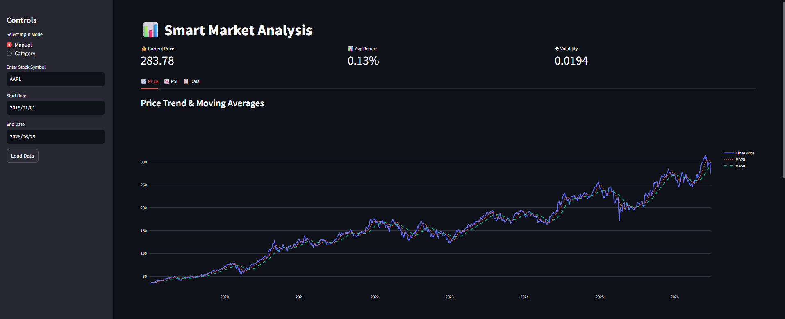
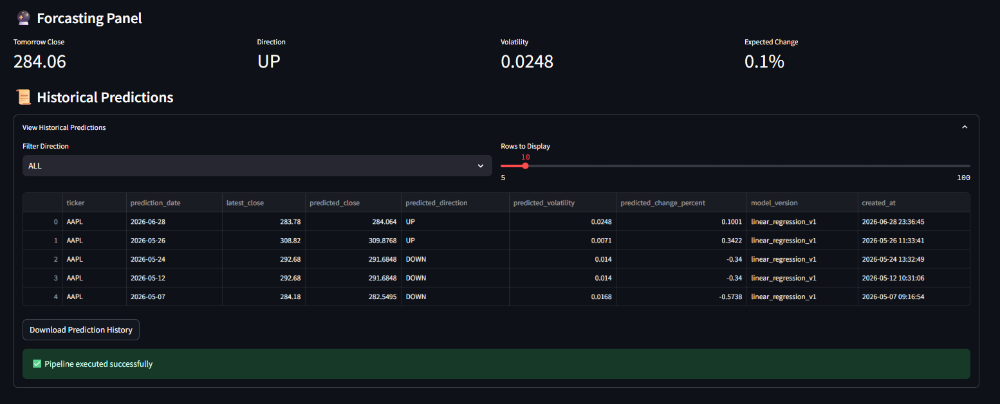

# 📈 Stock Market Data Engineering Pipeline

An end-to-end **Data Engineering** project that demonstrates how historical stock market data can be collected, processed, transformed, and visualized using Python.

The project implements a modular data pipeline that retrieves financial market data from Yahoo Finance, performs data validation and cleaning, generates analytical features, calculates technical indicators, and presents the processed data through an interactive Streamlit dashboard.

> **Project Type:** Data Engineering + Financial Analytics + Dashboard Development

---

## 📌 Project Overview

This project was developed to demonstrate the core concepts of Data Engineering using real-world financial data.

The pipeline automates the complete workflow of preparing stock market data for analysis by following industry-standard data processing practices.

The project includes:

- Automated data collection
- Data validation
- Data cleaning
- Feature engineering
- Technical indicator generation
- Interactive dashboard
- Processed dataset export

---

## 🎯 Project Objectives

- Build a modular financial data pipeline.
- Process historical stock market data.
- Generate analytics-ready datasets.
- Visualize market trends interactively.
- Demonstrate Data Engineering best practices.
- Build a portfolio-ready project.

---

## 🏗️ Project Architecture

```
Yahoo Finance API
        │
        ▼
Data Ingestion
        │
        ▼
Data Validation
        │
        ▼
Data Cleaning
        │
        ▼
Data Transformation
        │
        ▼
Feature Engineering
        │
        ▼
Technical Indicators
        │
        ▼
Processed Dataset
        │
        ▼
Streamlit Dashboard
```

---

## 🚀 Features

- Historical Stock Data Collection
- Automated Data Cleaning
- Data Validation Pipeline
- Feature Engineering
- Moving Average (MA20 & MA50)
- Relative Strength Index (RSI)
- Daily Return Calculation
- Volatility Analysis
- Statistical Trend Estimation
- Interactive Plotly Charts
- KPI Dashboard
- CSV Export

---

## 🛠️ Technology Stack

| Category | Technology |
|----------|------------|
| Language | Python |
| Dashboard | Streamlit |
| Data Processing | Pandas |
| Numerical Computing | NumPy |
| Visualization | Plotly |
| Financial Data | Yahoo Finance (yfinance) |
| Version Control | Git & GitHub |

---

## 📂 Project Structure

```
stock-market-data-engineering-pipeline/
│
├── app/
├── data/
├── database/
├── models/
├── notebook/
├── output/
├── pipeline/
├── reports/
├── utils/
│
├── app.py
├── requirements.txt
├── README.md
├── LICENSE
└── .gitignore
```

---

## 📚 Project Documentation

Detailed documentation is available in the **reports/** directory.

| Document |
|----------|
| 00_Project_Abstract.md |
| 01_Project_Overview.md |
| 02_Problem_Statement.md |
| 03_Business_Understanding.md |
| 04_System_Architecture.md |
| 05_Data_Pipeline.md |
| 06_Data_Cleaning.md |
| 07_Feature_Engineering.md |
| 08_Technical_Indicators.md |
| 09_Dashboard_Design.md |
| 10_Testing_and_Results.md |
| 11_Project_Limitations.md |
| 12_Future_Enhancements.md |

---

## ⚙️ Installation

Clone the repository

```bash
git clone https://github.com/yourusername/stock-market-data-engineering-pipeline.git
```

Move into the project directory

```bash
cd stock-market-data-engineering-pipeline
```

Install dependencies

```bash
pip install -r requirements.txt
```

---

## ▶️ Run the Application

```bash
streamlit run app.py
```

The dashboard will open automatically in your browser.

---

## 📊 Dashboard Preview





## 🔄 Data Pipeline Workflow

1. Retrieve historical stock market data.
2. Validate incoming dataset.
3. Clean missing and inconsistent values.
4. Transform raw data into a structured format.
5. Generate analytical features.
6. Calculate technical indicators.
7. Visualize processed data.
8. Export processed dataset.

---

## 📈 Current Capabilities

✔ Historical Stock Data Analysis

✔ Data Cleaning Pipeline

✔ Feature Engineering

✔ Technical Indicators

✔ Interactive Dashboard

✔ CSV Export

✔ Modular Project Structure

---

## 🚧 Future Enhancements

- Database Integration
- ETL Scheduling
- Cloud Deployment
- Real-Time Data Streaming
- Docker Support
- GitHub Actions CI/CD
- Additional Technical Indicators
- Portfolio Analysis
- Machine Learning Forecasting

---

## ⚠️ Disclaimer

This project was developed for educational purposes to demonstrate Data Engineering concepts using financial market data.

The statistical trend estimation included in the dashboard is intended for analytical exploration only and should not be interpreted as financial advice or as a reliable stock price forecasting model.

---

## 👨‍💻 Author

**Lakhanpal**

B.Tech Computer Science Engineering

Aspiring Data Engineer | Data Analyst

---

## 📄 License

This project is licensed under the MIT License.